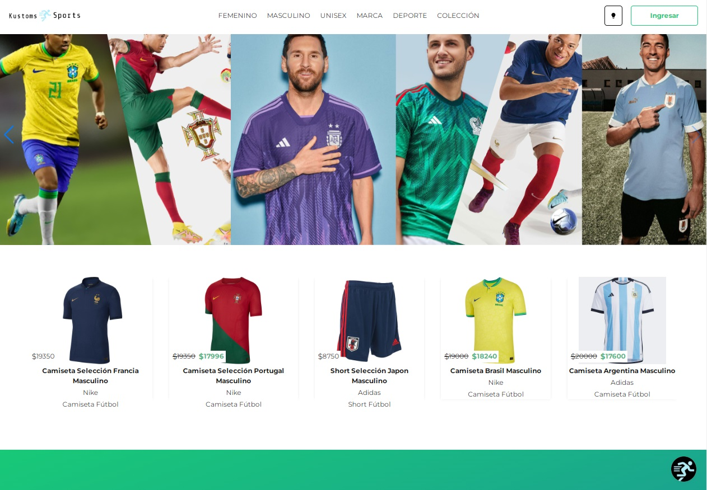
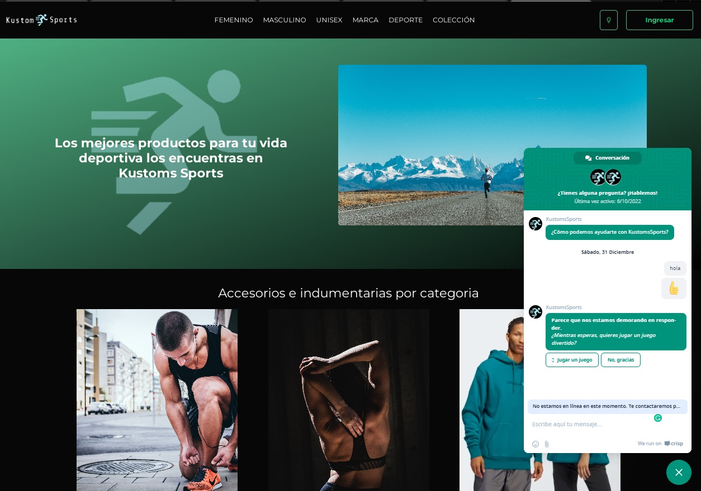
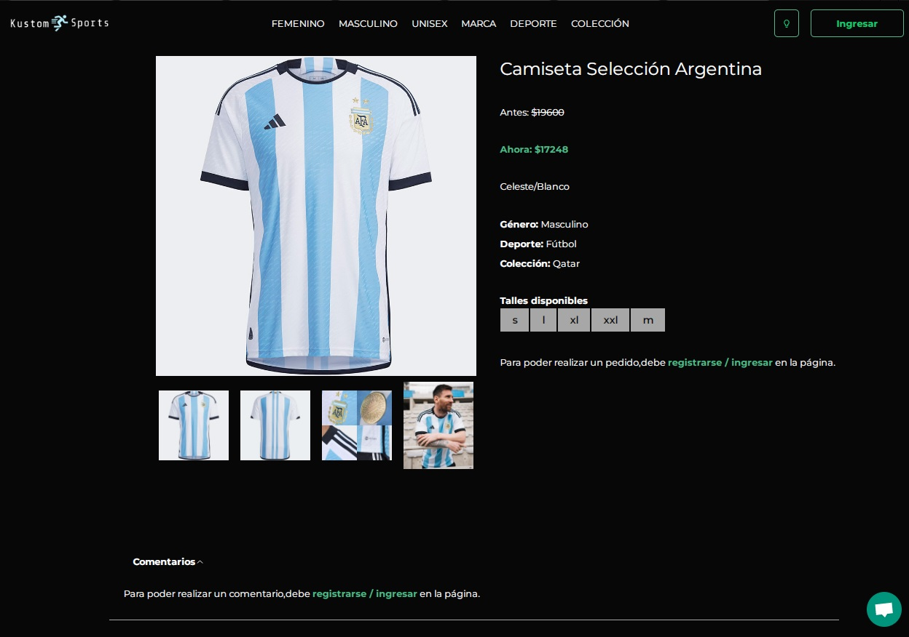
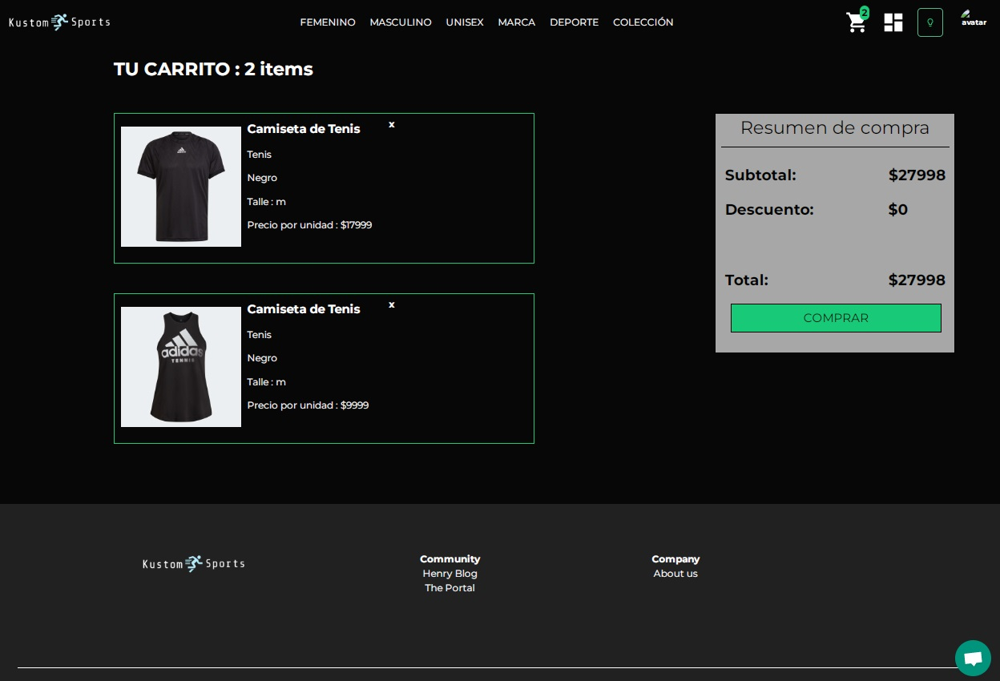
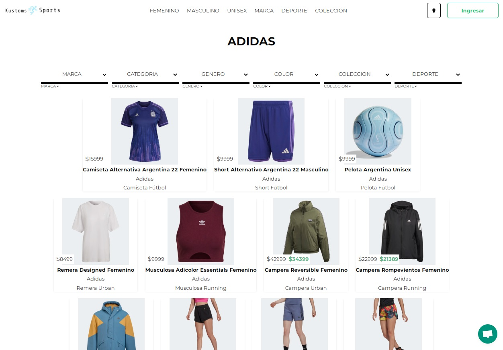
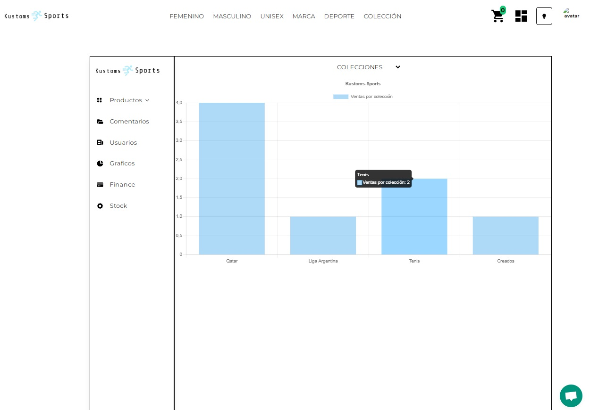
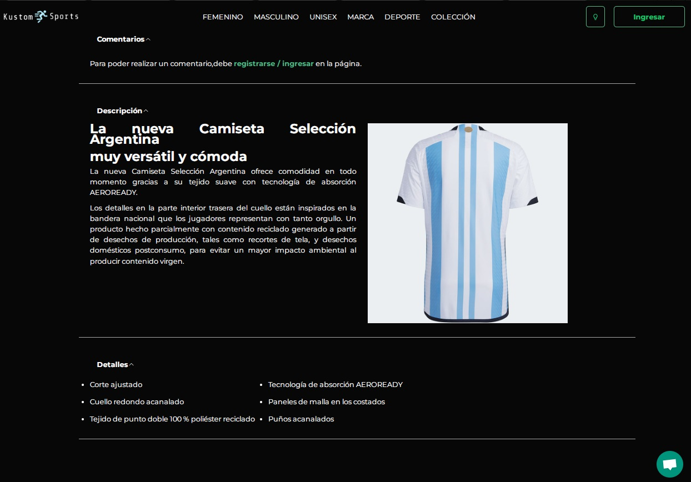
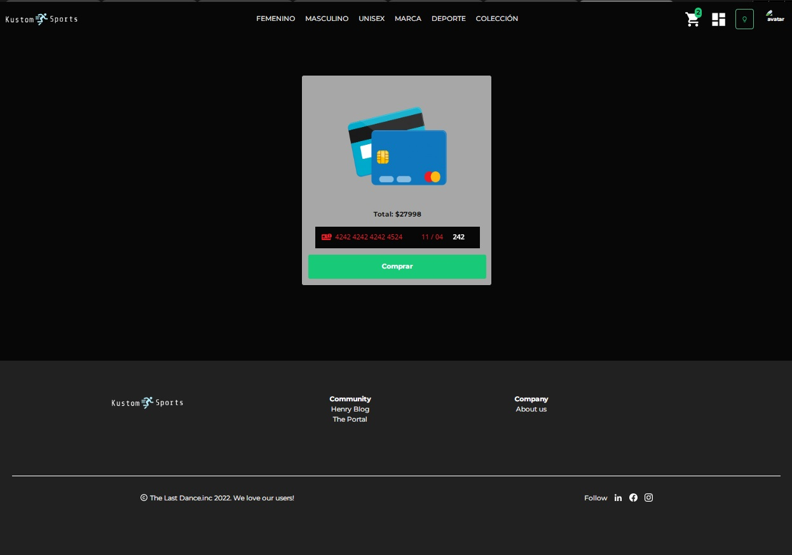

<h1>KUSTOMS SPORTS (e-commerce)</h1>
<h3> sportswear e-commerce website </h3>

1º clone

2º npm install in api folder

3º npm install in client folder

4º npm start in api folder

5º npm start in client folder

<h2>Home</h2>

<h2>Chatbot</h2>

<h2>Product</h2>

<h2>Cart</h2>

<h2>Gallery</h2>

<h2>Dashboard</h2>

<h2>Product Details</h2>

<h2>Payment</h2>

Group Project for the Full Stack Web Development career at soyHenry

- Creation of fictitious e-commerce with the following Tech Objectives: Deploy the app, User Authentication System, Payment Gateway and complete purchase process, Combined Filters, Implementation of Cloudinary for managing images, Notifications to users by e-mail, Logical Deletion of products and bans, Data Persistence, Reviews and Scoring System, Administrator Dashboard.

- We implement the use of React, Redux and Tailwind technologies for the Frontend; Node, Express for the Backend and PostgreSQL with Sequelize for the Database. In addition to libraries such as Stripe, Auth0, Sweetalert, Cloudinary, Nodemailer, among others. 

